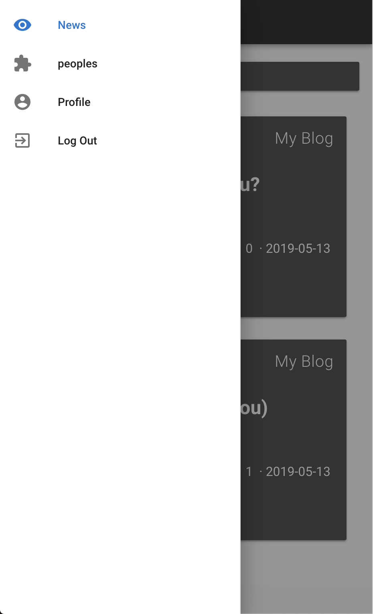

# pa-app
This is a web application (social network) on vueJS

Link to backend: https://github.com/FedorkaVitalik/PA-API

Login

SignUp

main 

drawer

new post

edit post

people

search

follow

change profile

myPosts

deletePost

#myFollowers

